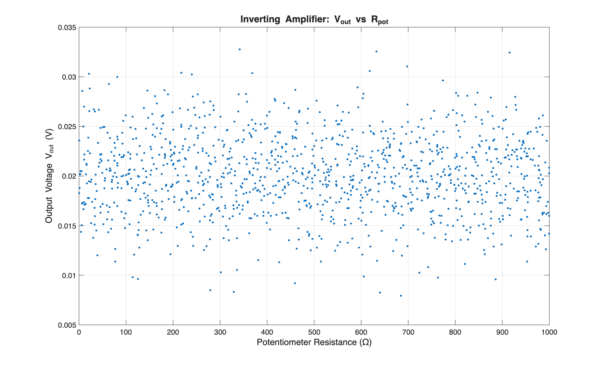
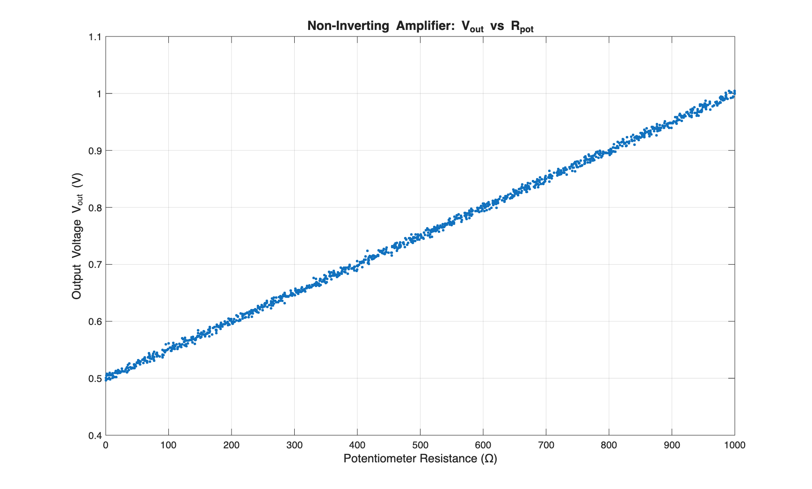
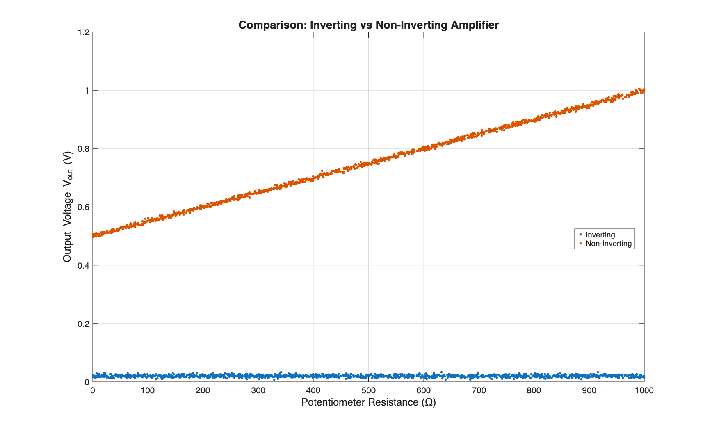
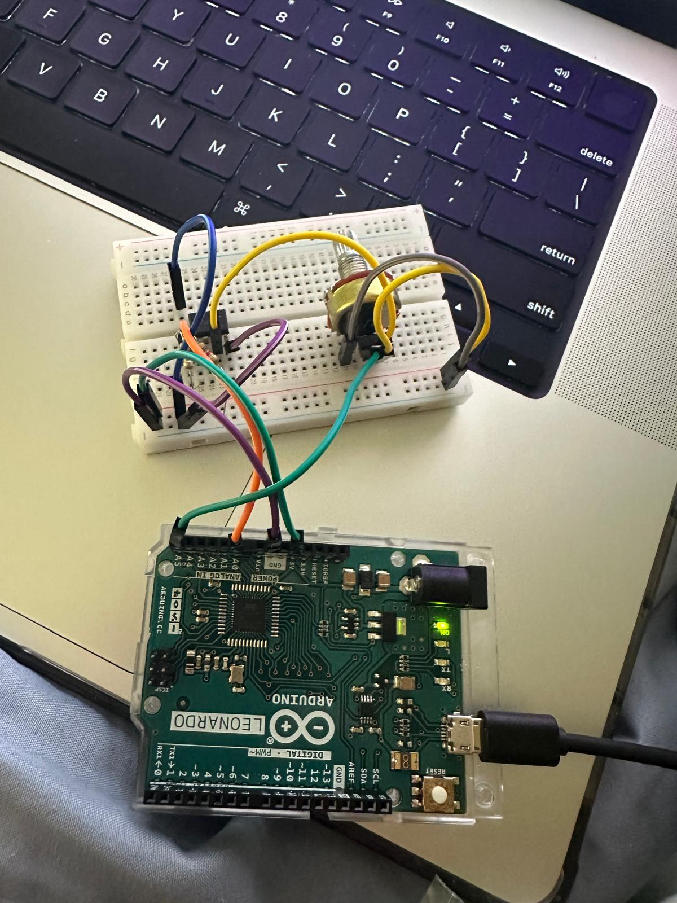

# Inverting and Non-Inverting Operational Amplifier Analysis (MATLAB)

## Overview
This project analyzes inverting and non-inverting operational amplifier configurations using MATLAB. Experimental amplifier data are loaded and visualized to compare gain behavior and output response across configurations.

## Tools
- MATLAB (data loading, analysis, and plotting)
- Arduino Uno (data acquisition)
- Operational amplifiers (inverting and non-inverting configurations)
- Breadboard and discrete components (resistors, wiring)

## Methods
The MATLAB script performs:
- Loading of amplifier measurement data
- Gain and output response visualization
- Direct comparison between inverting and non-inverting amplifier behavior

The analysis focuses on understanding how amplifier configuration affects signal gain and polarity.

## Results

### Inverting Amplifier

### Non-Inverting Amplifier

### Configuration Comparison

## Circuit Setup

### Circuit Configuration 1

### Circuit Configuration 2

## Files
- `Assignment5.m` — MATLAB analysis script  
- `Assignment5.fig` — MATLAB figure file  
- `inverting_amp_plot.png` — inverting amplifier response  
- `noninverting_amp_plot.png` — non-inverting amplifier response  
- `comparison_plot.png` — side-by-side comparison  

